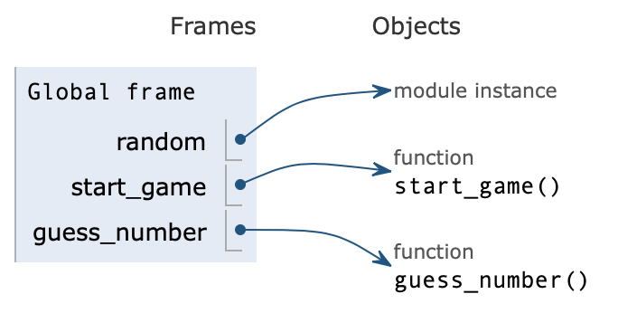

# Running a program in a debugger

## 1. What is a debugger?
When writing a program you often quickly want to check whether a piece of code executes as you expect it to do. Print statements can be used for this, but in some cases many print statements are needed to show all the information you need, which can easily become cluttered. Furthermore, print only shows you a string representation of an object. You can for example not see the difference between the integer 3 or the string "3". 
When debugging more complex code, a debugger can come in handy. With a debugger you can set breakpoints in your code, step forward through the code line by line and examine or even modify variables and objects live. 

There exist many different Python debugger programs, but they have the same basic functionality. In this course we will be using the online debugger [Python Tutor](http://www.pythontutor.com/).
 Alternatively, for many code editors there exist python debugger packages, and some editors have a debugger built in. It is even possible to use a debugger on the command line with the built-in module [pdb](https://docs.python.org/3/library/pdb.html), although it is not the easiest interface. 
 

## 2. Try it yourself!

Inspect the code of this [simple guessing game](http://www.pythontutor.com/visualize.html#code=import%20random%0A%0A%0Adef%20start_game%28%29%3A%0A%20%20%20%20print%28%22Hello!%22%29%0A%20%20%20%20play_game%20%3D%20input%28%22would%20you%20like%20to%20play%20a%20game%3F%20please%20write%20'yes'%20%22%29%0A%0A%20%20%20%20if%20play_game%20%3D%3D%20%22yes%22%3A%0A%20%20%20%20%20%20%20%20print%28%22Let's%20start!%22%29%0A%20%20%20%20%20%20%20%20guess_number%28%29%0A%20%20%20%20else%3A%0A%20%20%20%20%20%20%20%20print%28%22Too%20bad!%22%29%0A%0Adef%20guess_number%28%29%3A%0A%20%20%20%20user_guess%20%3D%20input%28%22Guess%20a%20number%20between%201%20and%2010%20%22%29%0A%20%20%20%20user_guess_int%20%3D%20int%28user_guess%29%0A%0A%20%20%20%20%23%20Select%20a%20random%20number%20between%201%20and%2010%0A%20%20%20%20correct_number%20%3D%20random.randint%281,%2010%29%0A%0A%20%20%20%20if%20user_guess_int%20%3D%3D%20correct_number%3A%0A%20%20%20%20%20%20%20%20print%28%22You%20guessed%20it%20right!%20How%20did%20you%20know%20that%3F!%22%29%0A%20%20%20%20else%3A%0A%20%20%20%20%20%20%20%20print%28%22Wrong!%20The%20correct%20number%20was%22,%20correct_number%29%0A%0A%0Astart_game%28%29&cumulative=false&curInstr=0&heapPrimitives=nevernest&mode=display&origin=opt-frontend.js&py=3&rawInputLstJSON=%5B%5D&textReferences=false) in Python Tutor. 

### 2.1 Stepping through code line by line

Anything that we define in our program (including variables, procedures/functions, etcetera) will show up on the right side. Note that Python Tutor shows some terms that we have not (yet) discussed in this course (e.g., objects and frames), it is not essential right now to understand all of these terms. 

In this case, we can find the module that is imported and the two functions (procedures) that are defined.

Afterwards we enter the first procedure `start_game()` which subsequently calls `guess_number()`. On the right side of the screen you can see the procedures being called (in the order in which they are being called), and the variables that are defined inside these procedures. 

Note that when we ask the user to fill in a number using `input`, this number is stored as a string named `user_guess`. This string is then cast to an integer named `user_guess_int`. The difference between the integer and string can easily be identified by the quotation marks. 

## 3 Some final notes

- More code examples can be found on the Python Tutor home page, click 'Show code examples'.

- Sometimes you want to inspect a piece of code without having to click through all the previous lines of code to get there. In those cases, you could set a 'breakpoint'.  Breakpoints can be added by clicking on a line number, which will then turn red. This will now become the next line to execute. 

